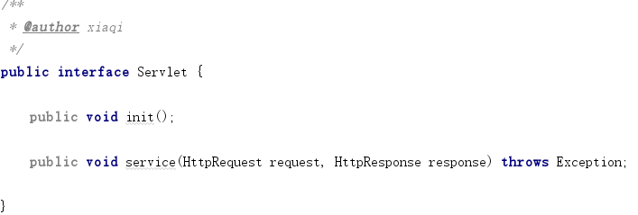
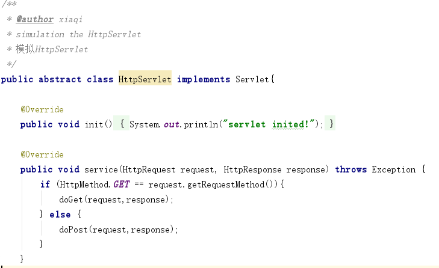
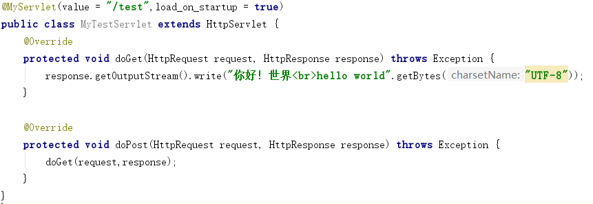
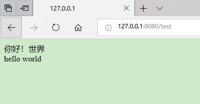

#### My implementation of mini tomcat (based-BIO)

##### major technology
1. Java reflection
2. Java I/0
3. Java network programming

##### the process of development

1. finishing the parser of http request.
2. finishing the component(servlet) scanning,and initialization of servletMapping. 
3. finishing the Servlet interface,and the binding between url and servlet implementation.
4. finishing the process of response.
---
#### 基于BIO实现的mini版tomcat

##### 使用的主要技术
1. Java的反射机制
2. Java的I/0流
3. Java的网络编程

##### 开发流程
1. 完成对http请求报文的解析
2. 完成对组件（servlet）的扫描，和servletMapping的初始化
3. 完成servlet接口的编写，并绑定url到对应的servlet
4. 完成对http响应报文的处理

---
##### my tomcat的启动流程

---
##### my tomcat的处理请求过程

---
##### 效果展示

example code:

---

---

---
测试：

